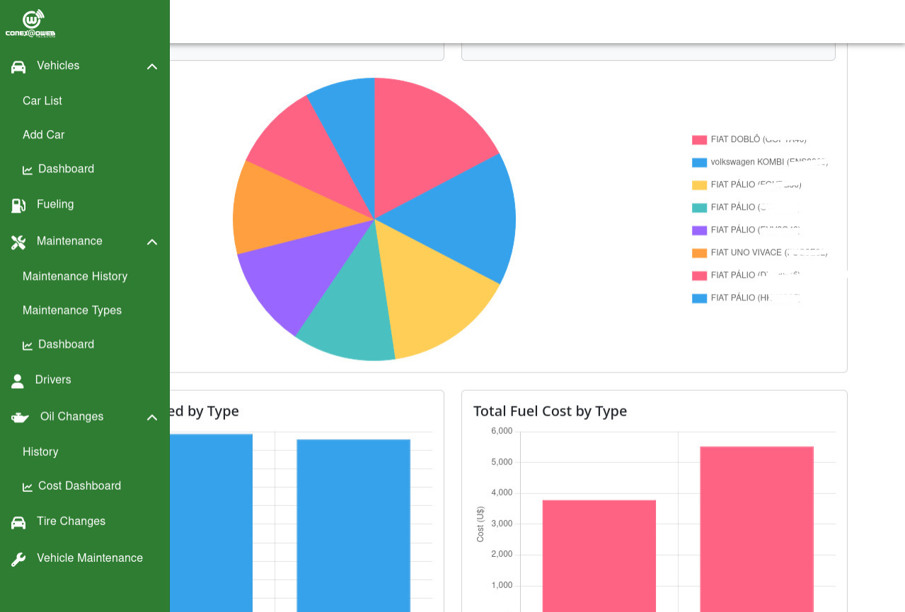
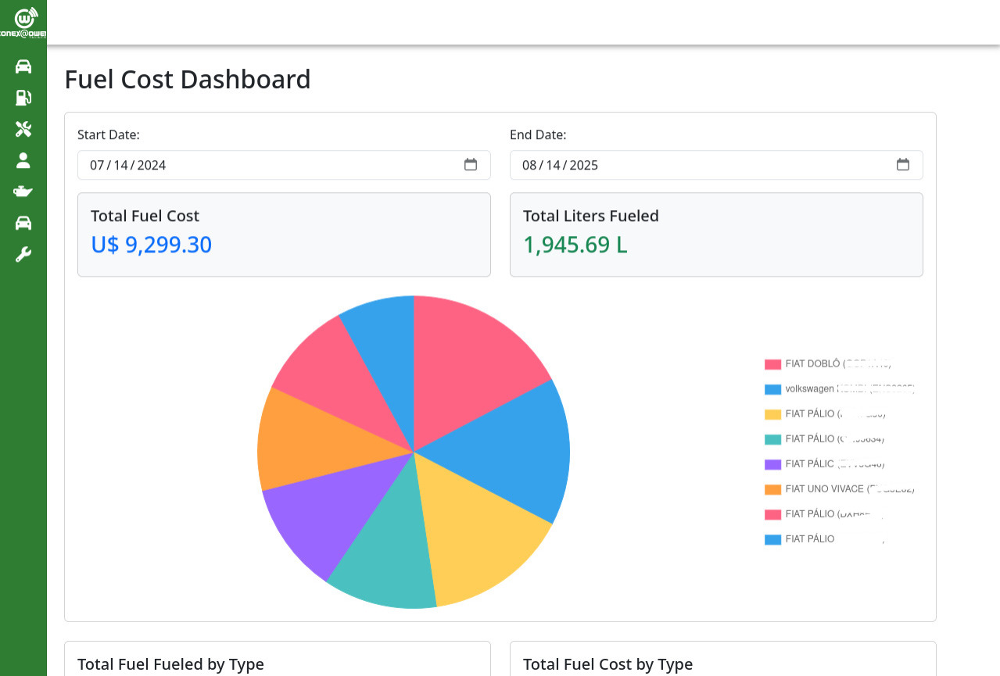
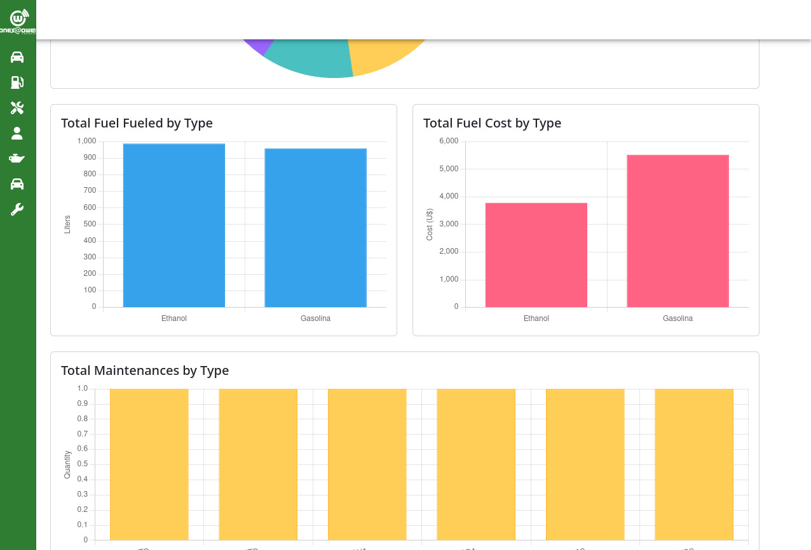
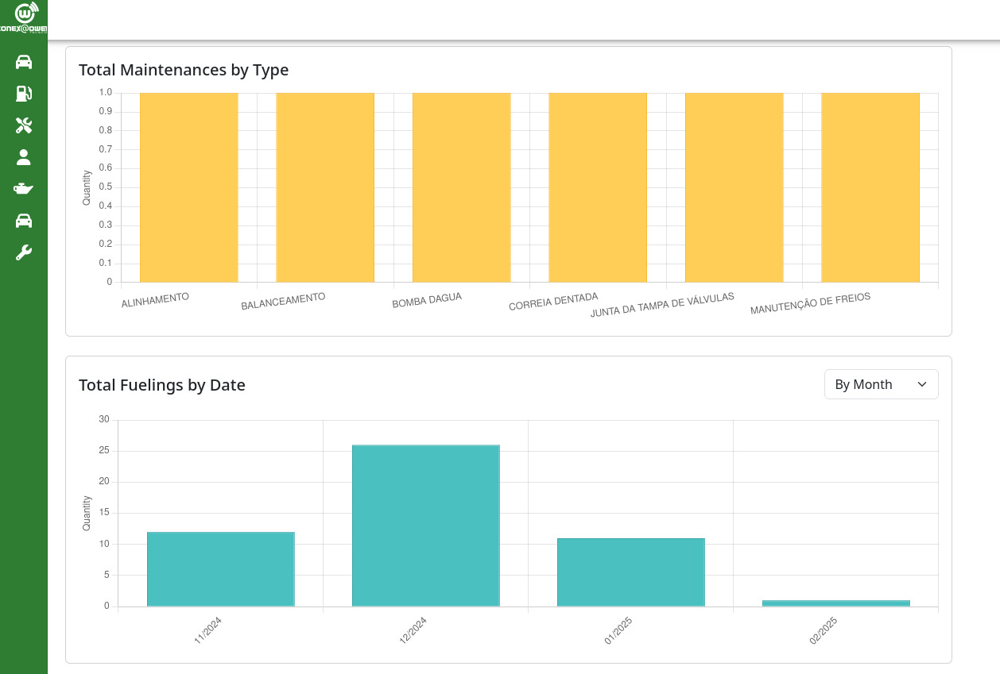

# SmartFleet

SmartFleet is a comprehensive fleet management system that helps organizations efficiently manage their vehicle fleets, track maintenance, and optimize operations.

## 🚀 Features

- Real-time vehicle tracking and monitoring
- Fleet maintenance scheduling and management
- Driver management and performance tracking
- Fuel consumption analytics
- Maintenance history tracking
- Reporting and analytics dashboard

## 🏗️ Project Structure

The project is organized into three main components:

```
SmartFleet/
├── frontend/     # React-based web application
├── backend/      # Node.js REST API server
└── database/     # Database migrations and schemas
```

## 🛠️ Technology Stack

### Frontend
- React.js with TypeScript
- Material-UI for components
- Redux for state management
- Axios for API communication

### Backend
- Node.js
- Express.js
- Jest for testing
- JWT for authentication

### Database
- MySQL
- mysql2 (Node.js MySQL client)

## 🚦 Getting Started

### Prerequisites

- Node.js (v14 or higher)
- npm or yarn
- MySQL (v8.0 or higher)

### Installation

1. Clone the repository:
```bash
git clone https://github.com/rafael-calixto1/SmartFleet.git
cd SmartFleet
```

2. Set up the backend:
```bash
cd backend
npm install
cp .env.example .env
# Configure your .env file with appropriate values
```

3. Set up the frontend:
```bash
cd ../frontend
npm install
cp .env.example .env
# Configure your .env file with appropriate values
```

4. Set up the database:
```bash
cd ../database
# Follow database setup instructions in database/README.md
```

### Running the Application

1. Start the backend server:
```bash
cd backend
npm run dev
```

2. Start the frontend development server:
```bash
cd frontend
npm start
```

The application will be available at `http://localhost:3000`

## 📚 Documentation

- [Frontend Documentation](./frontend/README.md)
- [Backend Documentation](./backend/README.md)

## 🧪 Testing

### Backend Tests
```bash
cd backend
npm test
```

### Frontend Tests
```bash
cd frontend
npm test
```

## 🤝 Contributing

1. Fork the repository
2. Create your feature branch (`git checkout -b feature/AmazingFeature`)
3. Commit your changes (`git commit -m 'Add some AmazingFeature'`)
4. Push to the branch (`git push origin feature/AmazingFeature`)
5. Open a Pull Request

## 📄 License

This project is licensed under the MIT License - see the [LICENSE](LICENSE) file for details.

## 📸 Preview

Here are some screenshots of the SmartFleet application:

### Dashboard - Fuel Costs


### Dashboard - Full Fuel Costs


### Dashboard - Fuel Types and Maintenance


### Dashboard - Maintenance and Refueling
